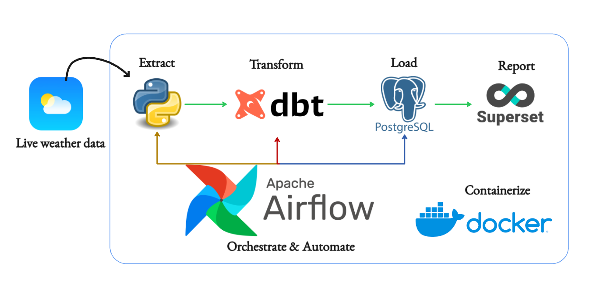

# 🌦️ Live Weather Data Pipeline

This project implements an end-to-end data pipeline that extracts **live weather data**, transforms it using **dbt**, loads it into a **PostgreSQL** database, and visualizes insights via **Apache Superset**. The entire pipeline is orchestrated using **Apache Airflow** and containerized with **Docker** for ease of deployment.

## 🖼️ Architecture Overview



## 🚀 Components Breakdown

### 1. **Extract** - `Python`
- Fetches live weather data from a weather API (e.g., OpenWeatherMap).
- Parses and stores raw data for transformation.

### 2. **Transform** - `dbt (Data Build Tool)`
- Performs SQL-based transformation and data modeling.
- Creates structured weather datasets ready for analysis.

### 3. **Load** - `PostgreSQL`
- Stores the transformed weather data.
- Acts as a central data warehouse for Superset.

### 4. **Report** - `Apache Superset`
- Connects to PostgreSQL to build dashboards.
- Enables interactive visual analytics for weather trends.

### 5. **Orchestrate & Automate** - `Apache Airflow`
- Manages pipeline scheduling and dependencies.
- Automates the extract, transform, and load steps.

### 6. **Containerization** - `Docker`
- All services are containerized for consistency and portability.
- Makes deployment on any environment seamless.

## 📦 Folder Structure

weather-pipeline/
├── airflow/ # DAGs and plugins
├── dbt/ # dbt models and config
├── superset/ # Superset setup
├── postgres/ # SQL init scripts and data volume
├── scripts/ # Python scripts to extract weather data
├── docker-compose.yml # Multi-container orchestration
└── README.md # Project documentation


## 🛠️ Prerequisites

- Docker & Docker Compose
- Python 3.x
- dbt CLI

## ▶️ Getting Started

```bash
# 1. Clone the repository
git clone https://github.com/Anass-NB/weather-data-pipeline.git
cd weather-data-pipeline

# 2. Start the containers
docker-compose up --build

# 3. Access tools
# Airflow: http://localhost:8080
# Superset: http://localhost:8088
# PostgreSQL: localhost:5432 (user: postgres / password: postgres)
```


### 📊 Dashboards
- Visualizations include:

- Current weather snapshots by city

- Temperature and humidity trends

- Weather condition distributions over time